# Advanced Data Structures project
### RB and Heap tree visualisator
#### Cercel Claudiu
> 1. Scope of the project:
> > Besides the need of a project for the ADS laboratory, the Project was made mostly to test my abilities in understanding the structure of red-black trees. 
> > It was also made to create a simple view of the Max/Min Heap tree.
> 2. Language used: ***C++***
> 3. How it works?
> > The project is a console aplication where you will be welcomed by a simple menu with choices.  
> > 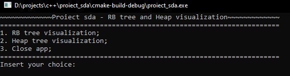    
> > As you can see the program waits for your input. So mostly you need to insert one of the values 1, 2 or 3. The program also has a wrong choice case where it warns you to write a valid number
> >
> >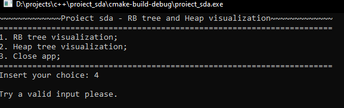
> > ### 1. ***Red Black Tree visualisator***
> >
> > When entering the menu for the RB Tree you are awaited to insert the keys for the creation of the tree.  
> >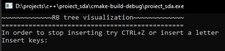    
> >The structure of the code is basically a while loop where it reads from the keyboard and creates a list of keys which are inserted in the tree by calling RBTree.insert. After the RBTree class handles the insertion of the keys the tree will be shown by calling RBTree.disp.  
> >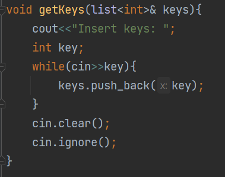 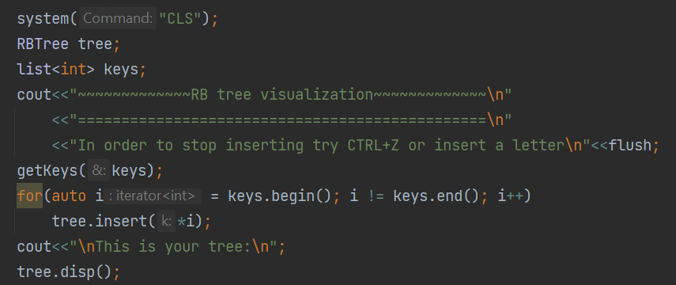   
> >After all this code the program will show the tree using this format:
> > > NODE:/Left:/Right:(it depends where the traversal of the tree)  
> > > Key:  
> > > Colour: BLACK/RED   
> > > Parent: "There is no parent of the node." if the node is **the root**
> > > Right Child:/There is no right child of the node.  
> > > Left Child:/There is no left child of the node.    
> >
> >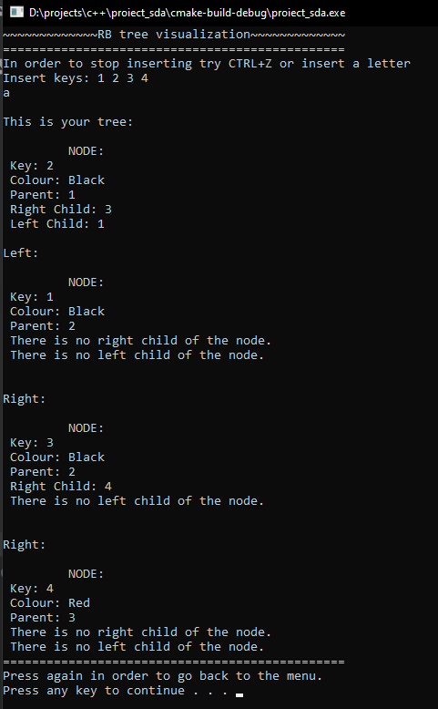
> > ### 2. ***Min/Max Heap Tree visualisator***
> >
> >Just like RBTree visualisator you will be awaited to insert the keys for the creation of the tree.  
> >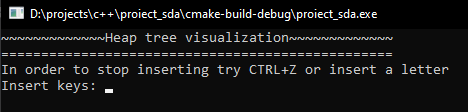    
> >Again like the RbTree the keys will be inserten into a list of keys and then it will be inserted in the tree. The difference comes here by adding an option in which you have to select what kind of Heap you want to see (Min or Max).  
> >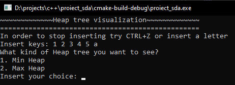    
> >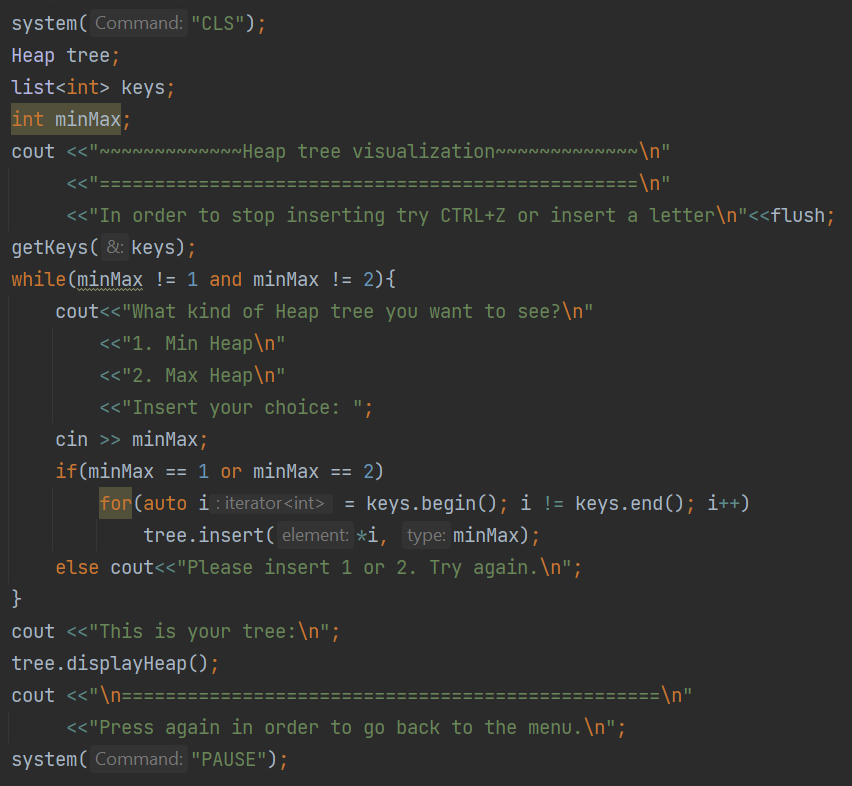   
> >After that the tree will be shown by placing the nodes in the correct spot: left/right.  
> > >Min:  
> > >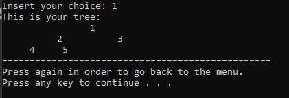    
> > >Max:  
> > >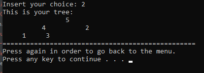